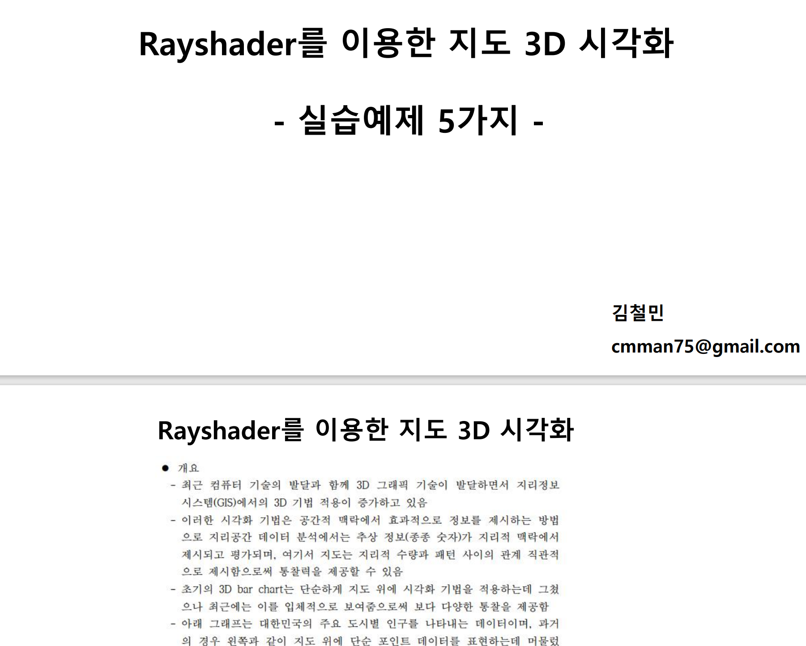

# 오픈업 커뮤니티지원 결과보고 4월

## 회의 목적 & 내용: 

37회 Shinykorea 정기밋업

* 일시 - 2023년 4월 11일(화), 18시30분-21시

* 장소 - zoom 온라인 or [토즈 삼성점](https://map.naver.com/v5/search/%ED%86%A0%EC%A6%88%20%EC%82%BC%EC%84%B1%EC%A0%90/place/13442313?placePath=%3Fentry=pll%26from=nx%26fromNxList=true&c=15,0,0,0,dh)

* 후원 - [Open UP 커뮤니티 지원 사업](https://www.oss.kr/community_support_cm/show/2de472f0-6a84-4d5c-90f1-142231938d17?page=2), [차라투(주)](https://www.zarathu.com/)

* 발표 내용:
     + 김철민: [3D GIS Visualization with shiny](https://github.com/cmman75/Lecture/blob/main/2304_3D%EC%A7%80%EB%8F%84_%EB%A7%8C%EB%93%A4%EA%B8%B0/2304_R%20%EC%8A%A4%ED%84%B0%EB%94%94%20%EB%B0%9C%ED%91%9C_3D%EC%A7%80%EB%8F%84.pdf)
     + 김진환: [Creating Standalone Apps from Shiny with Electron](https://www-r--bloggers-com.cdn.ampproject.org/c/s/www.r-bloggers.com/2023/03/creating-standalone-apps-from-shiny-with-electron-2023-macos-m1/amp/) 

2. 모임 진행 사진(참석한 모든 인원의 나오는 사진 3장과 참석자 명단)

* 참석자 - [김진섭](https://github.com/jinseob2kim),  [나영준](https://github.com/YoungjunNa), [김철민](https://github.com/cmman75), [김진환](https://github.com/jhk0530), 문우영, 손동욱, 김가연, 강동훈, 김영호, 조호연, 김경수

3. 첨부자료(회의 진행 하실 때 공유하신 자료 및 개발 진행 사진 3장)을 메일 부탁드립니다.

김철민 - 

김진환 

